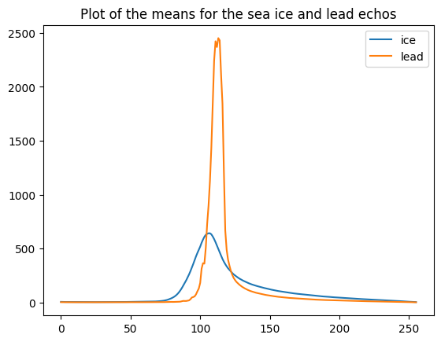
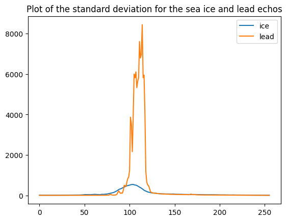

# GEOL0069_Week4

<!-- Back to top link -->
<a name="readme-top"></a>

  <h3 align="center">Sea-ice and lead unsupervised classification</h3>

  <p align="justify">
    This project contains the Week 4 assignment for the GEOL0069 Artificial Intelligence for Earth Observation module at UCL. The project focuses on using unsupervised learning methods to discriminate between sea ice and leads using Sentinel-3 altimetry data. There are lots of unsupervised classification methods out there, but in this project, we will cover K-means and Gaussian Mixture Models (GMM) clustering, each with its own pros and cons.
  </p>
</div>

<!-- TABLE OF CONTENTS -->
<details>
  <summary>Table of Contents</summary>
  <ol>
    <li>
      <a href="#introduction-to-unsupervised-learning">Introduction to unsupervised learning</a>
      <ul>
        <li><a href="#k-means-clustering">K-means Clustering</a>
        <li><a href="#gaussian-mixture-models">Gaussian Mixture Models (GMM)</a></li>
      </ul>
    </li>
    <li>
      <a href="#getting-started">Getting Started</a>
      <ul>
        <li><a href="#installation">Installation</a></li>
      </ul>
    </li>
    <li><a href="#results">Results</a></li>
    <li><a href="#contact">Contact</a></li>
    <li><a href="#acknowledgments">Acknowledgments</a></li>
  </ol>
</details>

<!-- INTRODUCTION -->
# Introduction to unsupervised learning

## K-means Clustering
K-means clustering is a type of unsupervised learning algorithm used for partitioning a dataset into a set of k groups (or clusters), where k represents the number of groups pre-specified by the analyst. It classifies the data points based on the similarity of the features of the data {cite}macqueen1967some. The basic idea is to define k centroids, one for each cluster, and then assign each data point to the nearest centroid, while keeping the centroids as small as possible.

### Why K-means for Clustering?
K-means clustering is particularly well-suited for applications where:
- The structure of the data is not known beforehand: K-means doesn’t require any prior knowledge about the data distribution or structure, making it ideal for exploratory data analysis.
- Simplicity and scalability: The algorithm is straightforward to implement and can scale to large datasets relatively easily.

### Key Components of K-means
- Choosing K: The number of clusters (k) is a parameter that needs to be specified before applying the algorithm.
- Centroids Initialization: The initial placement of the centroids can affect the final results.
- Assignment Step: Each data point is assigned to its nearest centroid, based on the squared Euclidean distance.
- Update Step: The centroids are recomputed as the center of all the data points assigned to the respective cluster.

### The Iterative Process of K-means
The assignment and update steps are repeated iteratively until the centroids no longer move significantly, meaning the within-cluster variation is minimised. This iterative process ensures that the algorithm converges to a result, which might be a local optimum.

### Advantages of K-means
- Efficiency: K-means is computationally efficient.
- Ease of interpretation: The results of k-means clustering are easy to understand and interpret.

## Gaussian Mixture Models
Gaussian Mixture Models (GMM) are a probabilistic model for representing normally distributed subpopulations within an overall population. The model assumes that the data is generated from a mixture of several Gaussian distributions, each with its own mean and variance {cite}reynolds2009gaussian, mclachlan2004finite. GMMs are widely used for clustering and density estimation, as they provide a method for representing complex distributions through the combination of simpler ones.

### Why Gaussian Mixture Models for Clustering?
Gaussian Mixture Models are particularly powerful in scenarios where:
- Soft clustering is needed: Unlike K-means, GMM provides the probability of each data point belonging to each cluster, offering a soft classification and understanding of the uncertainties in our data.
- Flexibility in cluster covariance: GMM allows for clusters to have different sizes and different shapes, making it more flexible to capture the true variance in the data.

### Key Components of GMM
- Number of Components (Gaussians): Similar to K in K-means, the number of Gaussians (components) is a parameter that needs to be set.
- Expectation-Maximization (EM) Algorithm: GMMs use the EM algorithm for fitting, iteratively improving the likelihood of the data given the model.
- Covariance Type: The shape, size, and orientation of the clusters are determined by the covariance type of the Gaussians (e.g., spherical, diagonal, tied, or full covariance).

### The EM Algorithm in GMM
The Expectation-Maximization (EM) algorithm is a two-step process:
- Expectation Step (E-step): Calculate the probability that each data point belongs to each cluster.
- Maximization Step (M-step): Update the parameters of the Gaussians (mean, covariance, and mixing coefficient) to maximize the likelihood of the data given these assignments.
This process is repeated until convergence, meaning the parameters do not significantly change from one iteration to the next.

### Advantages of GMM
- Soft Clustering: Provides a probabilistic framework for soft clustering, giving more information about the uncertainties in the data assignments.
- Cluster Shape Flexibility: Can adapt to ellipsoidal cluster shapes, thanks to the flexible covariance structure.

Below is a basic code implementation for a Gaussian Mixture Model.

```sh
from sklearn.mixture import GaussianMixture
import matplotlib.pyplot as plt
import numpy as np

# Sample data
X = np.random.rand(100, 2)

# GMM model
gmm = GaussianMixture(n_components=3)
gmm.fit(X)
y_gmm = gmm.predict(X)

# Plotting
plt.scatter(X[:, 0], X[:, 1], c=y_gmm, cmap='viridis')
centers = gmm.means_
plt.scatter(centers[:, 0], centers[:, 1], c='black', s=200, alpha=0.5)
plt.title('Gaussian Mixture Model')
plt.show()
  ```


<p align="right">(<a href="#readme-top">back to top</a>)</p>

<!-- GETTING STARTED -->
# Getting started

This project is created using Google Colab, which is a cloud-based service provided by Google that allows users to write, execute, and share Python code through a web browser. It offers free access to a machine equipped with a GPU, making it a popular choice for machine learning and data science projects. This is an user-freindly way to test, excecute machine learning tasks, without any environment set-up on your device.
To access the notebook, you can just click the Google Colab link in the ipynb file included in this repo.

### Installation

The following software needs to be installed to run the code.
* Using pip install:
  ```sh
  !pip install rasterio
  ```
  ```sh
  !pip install netCDF4
  ```
  ```sh
  !pip install basemap
  ```
  ```sh
  !pip install cartopy
  ```
* Mounting Google Drive on Google Colab
  ```sh
  from google.colab import drive
  drive.mount('/content/drive')
  ```

  <!-- RESULTS -->

## Results

The resulting clusters of functions can then be extracted and plotted using plt from matplotlib.pyplot. The echos (or functions) in the sea ice cluster are been labelled '0' and the lead echos are labelled '1' (i.e. waves_cleaned[clusters_gmm == 1] are lead echos).

The means of the sea ice and lead echos are calculated and plotted using the code below. It shows that the power of the echos for sea ice is lower than for leads, which could potentially be attributed to the difference in roughness between sea ice and water, as smoother surfaces are more reflective, and/or the difference in the dielectric properties between sea ice and water ([Jiang & Wu, 2004](https://doi.org/10.1002/asl.77)). The mean for leads is also noisier than for sea ice.

```sh
plt.plot(np.mean(waves_cleaned[clusters_gmm==0],axis=0),label='sea ice')
plt.plot(np.mean(waves_cleaned[clusters_gmm==1],axis=0),label='lead')

plt.title('Plot of the means for the sea ice and lead echos')
plt.legend()
  ```



The standard deviations of the sea ice and lead echos are calculated and plotted using the code below. It shows that there is much more variability in the shape of the lead echos than sea ice–the signal is noisier for leads than sea ice. This could be caused by differences in size and shape between the leads, leading to differences in the power and shape of the echos, as well as changes in the state of the leads as they freeze/refreeze and melt ([Britannica – Sea Ice](https://www.britannica.com/science/sea-ice)).


```sh
plt.plot(np.std(waves_cleaned[clusters_gmm==0],axis=0),label='sea ice')
plt.plot(np.std(waves_cleaned[clusters_gmm==1],axis=0),label='lead')

plt.title('Plot of the standard deviation for the sea ice and lead echos')
plt.legend()
  ```



We can also inspect how many data points are there in each class of your clustering prediction using the code below:

```sh
unique, counts = np.unique(clusters_gmm, return_counts=True)
class_counts = dict(zip(unique, counts))

print(class_counts)
  ```

Output:
Cluster counts: {np.int64(0): np.int64(8880), np.int64(1): np.int64(3315)}

Below is a confusion matrix comparing the ESA official classification (flags) against my GMM cluster classification:


<p align="right">(<a href="#readme-top">back to top</a>)</p>

<!-- CONTACT -->
# Contact
Shuyi Zheng - zczq923@ucl.ac.uk

Project Link: [[https://github.com/3030038487tro-creator/sea-ice-and-lead-unsupervised-learning](https://github.com/3030038487tro-creator/titanic.git)

<p align="right">(<a href="#readme-top">back to top</a>)</p>

<!-- ACKNOWLEDGMENTS -->
# Acknowledgments
- This project is part of an assignment for module GEOL0069 taught in UCL Earth Sciences Department
